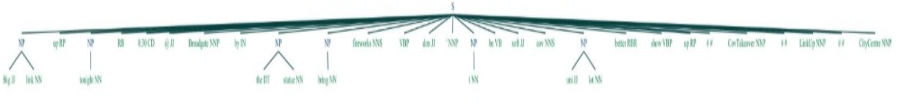
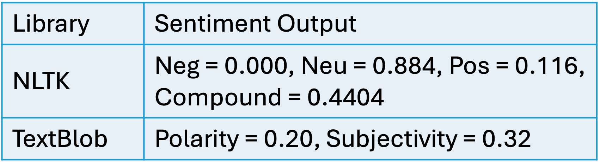

# 🧠 Social Media NLP Analysis
*An exploratory Natural Language Processing case study using NLTK and TextBlob.*

## 📌 Project Overview
This project explores how Natural Language Processing can be used to analyse unstructured social-media text for linguistic and contextual indicators associated with planned public gatherings.

A fictional social-media post was processed using NLTK and TextBlob. The analysis included tokenisation, stopword removal, stemming, lemmatisation, part-of-speech tagging, named-entity recognition, syntactic parsing and sentiment analysis.

The purpose of the project was not to make an automated enforcement decision, but to investigate how NLP tools can convert informal, noisy text into structured information that may support human-led risk assessment and further investigation.

## 🎯 Objectives
- Examine the characteristics of unstructured social-media text.
- Apply a standard NLP preprocessing pipeline.
- Identify references to time, location, mobilisation and physical objects.
- Compare NLTK and TextBlob outputs.
- Evaluate sentiment and grammatical structure.
- Discuss the limitations of rule-based NLP techniques.
- Consider how more advanced tools could improve contextual accuracy.

## 📝 Text Sample
The analysis used a fictional social-media post containing informal language, hashtags, emojis, a time reference, a location and mobilisation-related phrases.

The example was designed to demonstrate the challenges involved in analysing short, noisy and context-dependent social-media text.

## 🔄 NLP Pipeline
The workflow included:

1. Sentence segmentation
2. Tokenisation
3. Stopword removal
4. Stemming
5. Part-of-speech tagging
6. Lemmatisation
7. Named-entity recognition
8. Syntactic parsing
9. Sentiment analysis

### Parse Tree Generated by NLTK

The syntactic parse tree illustrates how NLTK identifies grammatical relationships between words, grouping them into meaningful linguistic structures despite the informal nature of the social media post.

## 💻 Python Scripts

The project is organised into two scripts:

- **nltk_analysis.py** – performs text preprocessing, POS tagging, named-entity recognition, parsing and sentiment analysis using NLTK.

- **textblob_analysis.py** – analyses the same text using TextBlob to compare tokenisation, sentiment analysis, parsing and lemmatisation outputs.

## 📊 Results
The NLP analysis successfully identified key linguistic features within the fictional social media post, including references to time, location, mobilisation and physical objects.

Sentiment analysis produced consistent findings across both libraries. NLTK identified a predominantly neutral message with a moderately positive tone, while TextBlob reported a slightly positive polarity and moderate subjectivity. Collectively, these results suggest enthusiasm or anticipation rather than explicit hostility or aggression.

### Sentiment Comparison

The table below summarises the sentiment outputs produced by NLTK and TextBlob.

## ⚖️ Limitations and Ethical Considerations
The analysis was based on a single fictional post and should not be interpreted as a reliable public-safety classification system.

Rule-based and lexicon-based NLP tools may misinterpret slang, sarcasm, emojis, coded language and local context. Automated outputs should therefore support, rather than replace, human judgement.

Any real-world application would also require careful consideration of privacy, proportionality, bias, transparency and the risk of incorrectly classifying harmless communication.

## 🧠 Skills Demonstrated
- Natural Language Processing
- Text preprocessing
- Tokenisation
- Stopword removal
- Stemming and lemmatisation
- Part-of-speech tagging
- Named-entity recognition
- Sentiment analysis
- Syntactic parsing
- Critical evaluation of NLP limitations

## 🚀 Future Improvements
Potential enhancements include:

- Analysing a larger, labelled dataset.
- Using spaCy for improved entity recognition and processing efficiency.
- Building a supervised text-classification model with scikit-learn.
- Comparing rule-based methods with transformer-based language models.
- Evaluating performance using precision, recall and F1-score.
- Introducing bias, fairness and explainability testing.

## 📄 Report
[View the full NLP analysis report](reports/Social_Media_NLP_Analysis_Report.pdf)

## 🌍 About the Author

Hi, I'm **Mia Emanuele**.

I'm a **Data Scientist** with a passion for statistical modelling, machine learning and explainable AI.

I enjoy **finding the "why" behind the data**—using data to uncover patterns, explain complex systems and support better decisions.

This repository forms part of my professional portfolio, showcasing projects completed during my MSc that have since been refined and expanded to demonstrate both technical expertise and analytical thinking.

### Connect with me

💼 LinkedIn: www.linkedin.com/in/mia-emanuele

💻 GitHub: https://github.com/miaemanuele77-ds

---

⭐ Thank you for taking the time to explore my work.

Feedback, discussion and collaboration are always welcome.

